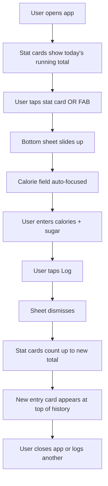
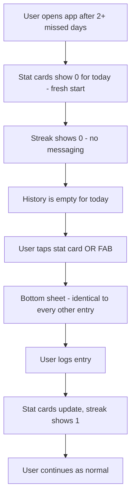
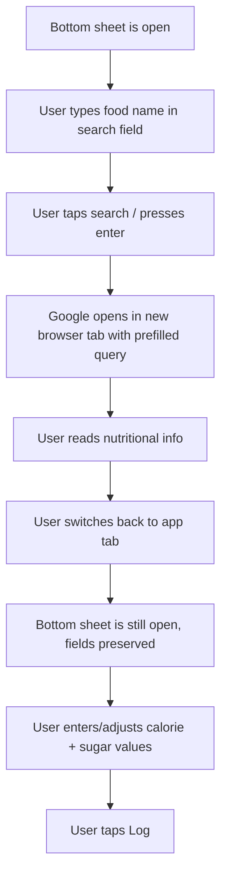
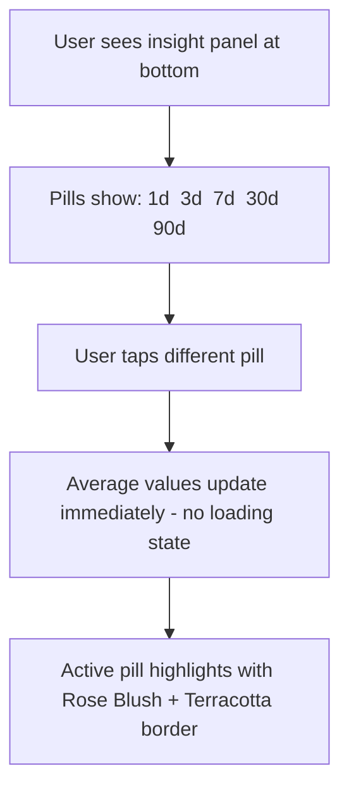

---
stepsCompleted:
  - step-01-init
  - step-02-discovery
  - step-03-core-experience
  - step-04-emotional-response
  - step-05-inspiration
  - step-06-design-system
  - step-07-defining-experience
  - step-08-visual-foundation
  - step-09-design-directions
  - step-10-user-journeys
  - step-11-component-strategy
  - step-12-ux-patterns
  - step-13-responsive-accessibility
  - step-14-complete
inputDocuments:
  - _bmad-output/planning-artifacts/prd.md
  - _bmad-output/planning-artifacts/product-brief-calorie-sugar-tracker-2026-03-04.md
workflowType: ux-design
date: 2026-03-04T00:00:00.000Z
author: Balaji
project: calorie-sugar-tracker
---
# UX Design Specification - calorie-sugar-tracker

**Author:** Balaji
**Date:** 2026-03-04

---

<!-- UX design content will be appended sequentially through collaborative workflow steps -->

## Executive Summary

### Project Vision

calorie-sugar-tracker is a radically minimal single-screen web app that makes consistent food logging possible by eliminating every source of friction. Users log two numbers — calories (kcal) and sugar (g) — auto-timestamped, with no account, no food database, and no setup of any kind. The product's character is defined as much by what it refuses to do as by what it does. Restraint is the architecture. Data lives in localStorage; the app is deployed as a static SPA on Vercel.

The product is built on a single hypothesis: a rough estimate logged consistently is vastly more valuable than a precise entry logged twice then abandoned. It is designed to prevent cascade failure — the pattern where missing one entry makes recovery feel so costly that users abandon tracking entirely.

### Target Users

**The Threshold Tracker** — Health-conscious adults whose motivation to log has a hard ceiling. They have tried and churned from apps like MyFitnessPal. They need sub-10-second entry with zero friction on every interaction. The habit must survive imperfection — missing days should cost nothing to recover from.

**The Diabetes-Conscious One-Number Thinker** — Adults managing prediabetes or diabetes risk who already monitor a single critical number (blood glucose) and want the same mental model applied to food. Sugar is their primary signal, not an afterthought. They do not want a clinical dashboard — just the number, clean and neutral.

### Key Design Challenges

1. **Zero-state legibility** — The first-time user sees an empty screen with no onboarding. The entire interaction model (tap total → enter numbers → log) must be self-evident without instruction text or tutorials.
2. **Data-as-interface affordance** — The daily total is both the display and the primary entry trigger. The tappability of the numbers must be visually self-evident without a conventional button label.
3. **Neutral gap handling** — When a user returns after missed days, the history must show gaps with zero visual judgment — no red indicators, no penalty messaging. The visual language must be entirely calm and neutral.
4. **Mobile-first single-screen density** — Everything (total, history, insights, streak) must coexist on one small phone viewport with 44px+ tap targets, without feeling cluttered.

### Design Opportunities

1. **Restraint as visual identity** — Deliberate emptiness can be beautiful. Whitespace, refined typography, and a warm pastel palette can make minimalism feel intentional and calming rather than unfinished.
2. **Ambient feedback** — The streak counter and insight panel should be glanceable, not readable. Data as quiet backdrop rather than demanding dashboard.
3. **Speed as sensation** — If every interaction is demonstrably faster than any competing app (logging in under 10 seconds), speed itself becomes a distinctive and memorable product experience.

### Design Direction

**Color palette:** Modern, warm-pastel, subtle elegance. A palette anchored in muted warm tones — think soft terracotta, warm sand, dusty rose, and pale cream — with enough warmth to feel inviting but restrained enough to remain sophisticated. Not orange or yellow-warm; more a quiet warmth in the mid-tones. Neutral near-whites and soft greys as foundational surfaces.

**Visual style:** Modern and elegant throughout. Clean geometric forms, generous whitespace, refined typography (likely a humanist sans-serif), and minimal decorative elements. UI components feel crafted rather than generic — pill selectors, entry cards, and totals display should all carry a sense of considered detail. No sharp corners where rounded ones serve better. No heavy shadows; prefer subtle elevation and soft borders.

## Core User Experience

### Defining Experience

The product has one core action: logging a meal in under 10 seconds. Two number fields, auto-timestamped, one tap to confirm. Every other element in the app exists to support the conditions under which that action keeps happening — daily, without thought, without guilt.

Core loop: Open → see daily total → tap it → enter calories + sugar → log → done. No decision required at any step.

### Platform Strategy

- **Primary:** Mobile browser (the logging moment happens immediately after eating, phone in hand)
- **Secondary:** Desktop browser (same app, same single-screen layout, responsive)
- **Touch-first:** All interactions designed for thumb use — tap targets 44px minimum, bottom-sheet entry panel within thumb reach
- **No offline required** — app loads from Vercel CDN; localStorage handles persistence automatically
- **No platform-specific APIs** — vanilla web; no push notifications, no camera, no geolocation

### Effortless Interactions

| Interaction | How It Should Feel |
| --- | --- |
| Opening the app | Instant — see today's total, nothing else demands attention |
| Starting an entry | One tap on the daily total — no hunting for a button |
| Entering numbers | Numeric keyboard auto-focuses; two fields, tab between them |
| Smart search | Type food name → Google opens in new tab → return → numbers already in focus |
| Switching insight period | Tap a pill — immediate, no loading state |
| Returning after missed days | Identical to any other open — no penalty, no catch-up prompt |

### Critical Success Moments

1. **First log under 60 seconds** — The new user opens the app, sees an obvious single tap point, enters two numbers, and sees the total update. No confusion, no hesitation. If this fails, nothing else matters.
2. **The silent streak** — Somewhere in week 2, the user notices the streak counter without the app having drawn attention to it. The delight is in the discovery, not the announcement.
3. **The gap that costs nothing** — User returns after 2–3 missed days, logs once, and the experience is completely identical to day 1. No friction, no apology flow, no reset ceremony. This moment is the reason people don't churn.
4. **The insight glance** — User switches the pill selector from 3d to 7d and immediately understands their pattern from the two numbers that change. No chart, no interpretation needed.

### Experience Principles

1. **Speed is the product** — Every interaction must be measurably faster than any competing app. Friction is the enemy; speed is the design constraint.
2. **Data is the interface** — Numbers are not just displayed; they are the primary interactive elements. The UI has no chrome that doesn't carry meaning.
3. **Absence of judgment** — The app never reacts to what users log, how much, or how often. Visual neutrality is a functional requirement, not an aesthetic preference.
4. **Warmth through restraint** — The palette and visual style (warm pastels, clean forms, generous whitespace) make the space feel calm and welcoming without decorating it. The elegance comes from what's not there.
5. **Recovery is free** — Any design decision that would make returning harder than starting is wrong. The habit must survive imperfection by design.

## Desired Emotional Response

### Primary Emotional Goals

| Moment | Desired Feeling |
| --- | --- |
| Opening the app | **Calm** — no demands, no notifications, just today's numbers |
| Logging an entry | **Competent** — fast, frictionless, done; a small quiet win |
| Seeing the daily total update | **Aware** — not proud or guilty, just informed |
| Noticing the streak | **Quietly pleased** — discovered, not announced |
| Returning after a gap | **Relieved** — nothing to apologise for, no debt to repay |
| Checking the insight panel | **Curious** — patterns emerge naturally, never prescribed |

### Emotional Journey Mapping

- **First open:** Intrigue → instant clarity. No confusion, no setup wall. The UI answers "what do I do?" before the user even asks it.
- **First log:** Competence + mild surprise at the speed. "That was it?"
- **Day 3–7:** Quiet routine forming. The app has no personality demands — it just receives data.
- **Week 2–3:** The "aha" — the habit is already there. Mild delight at discovering it without being pushed.
- **After a missed day:** Relief. The app meets the user where they are, not where they should have been.
- **Long-term:** Trust. The app has never judged them, never pushed them. It's become a quiet daily companion.

### Micro-Emotions

| Cultivate | Avoid |
| --- | --- |
| Calm confidence | Anxiety about accuracy |
| Quiet satisfaction | Guilt for missing days |
| Gentle curiosity | Overwhelm from data |
| Relief at simplicity | Frustration with friction |
| Subtle delight in the speed | Pressure to perform |

### Design Implications

- **Calm → palette & spacing:** Warm pastels, generous whitespace, no urgent red/orange accent colours. Nothing competes for attention.
- **Competence → entry speed:** Numeric keyboard auto-opens, fields tab naturally, one-tap confirm. Speed is designed, not accidental.
- **Awareness without judgment → data display:** Totals are displayed in neutral type weight. No colour coding of high vs. low values. Numbers inform; they don't evaluate.
- **Quiet delight → streak counter:** Small, typographic, ambient. Not animated, not celebrated — just present for those who look.
- **Relief → gap handling:** No visual difference between a gap day and a logged day in the history except the absence of entries. Zero guilt design.

### Emotional Design Principles

1. **The app has no opinions** — It records. It calculates. It displays. It never reacts to the content of what's logged.
2. **Calm is a feature** — Every design choice (colour, spacing, motion, copy) should ask: does this add calm or subtract it?
3. **Delight lives in the margins** — Small moments (the streak number quietly updating, the total animating on entry) create delight through understatement, not fanfare.
4. **Trust is built by absence** — No ads, no upsells, no nudges. Each interaction where the app doesn't ask for something builds trust with the user.

## UX Pattern Analysis & Inspiration

### Inspiring Products Analysis

**Streaks (iOS habit tracker)**
- Solves the habit-formation problem with radical visual simplicity — circular day indicators, no text overload
- Onboarding is the app itself: you see empty circles, you understand you need to fill them
- Streak mechanic is ambient and non-punishing in tone
- Transferable: The idea of a streak as a glanceable ambient signal, not a gamification centrepiece

**Day One (journaling app)**
- Entry flow is frictionless — open, tap, type, done. The writing surface is the whole app.
- Typography and whitespace are the visual design; no chrome, no toolbars competing for space
- History is a calm, scrollable timeline — entries feel like objects, not data rows
- Transferable: The entry list as a calm, typographic timeline. Generous card spacing.

**Calm / Headspace (wellness apps)**
- Warm, muted palettes (soft golds, dusty roses, slate blues) that communicate safety and ease
- Nothing in the UI shouts — everything speaks quietly
- Illustrations and micro-animations are subtle and purposeful, never decorative noise
- Transferable: The emotional register of the visual language — warm, unhurried, trust-building

**Apple Health (data display)**
- Numbers displayed in large, confident type — the number is the hero, not a label
- Neutral colour treatment for data; no red/green value judgements baked into the display
- Transferable: Large, confident numeric display for the daily total. Neutrality in data colour.

### Transferable UX Patterns

| Category | Pattern | Application |
| --- | --- | --- |
| Navigation | Single-surface, no nav | The entire product is one screen — no tabs, no back buttons |
| Interaction | Bottom sheet entry | Entry panel slides up from the bottom, thumb-reachable on mobile |
| Interaction | Tap-to-add on data | Daily total is the entry trigger — data-as-interface |
| Visual | Large numeric hero | Daily total in oversized type, dominant on screen |
| Visual | Pill selector for filters | Insight period selector as a horizontal scrollable pill row |
| Visual | Card-based history | Each log entry as a clean, minimal card in a scrollable list |
| Feedback | Micro-animation on log | Subtle number count-up when total updates after an entry |
| Feedback | Ambient streak | Small typographic streak indicator — noticed, not announced |

### Anti-Patterns to Avoid

- **Database search as the entry path** — Creates the friction that kills the habit (MyFitnessPal model)
- **Onboarding carousels** — Any swipe-through screen is a barrier before first value
- **Red/green data colouring** — Implies judgment the user never asked for
- **Confirmation modals** — "Are you sure?" adds a tap that serves no one
- **Empty state with excessive copy** — Long explanatory text destroys the self-evident interface promise
- **Heavy bottom navigation bars** — Waste vertical space and imply complexity that doesn't exist

### Design Inspiration Strategy

**Adopt:**
- Streaks' ambient streak mechanic (typographic, non-celebratory)
- Day One's calm scrollable timeline for entry history
- Apple Health's large-type numeric hero display and data neutrality
- Wellness app palette register (warm, muted, unhurried)

**Adapt:**
- Bottom sheet entry (from iOS native patterns → web bottom-anchored drawer)
- Pill selector (from common filter UIs → simplified 5-option horizontal row)

**Avoid:**
- Any pattern implying a food database (search-first entry)
- Any pattern signalling gamification (badges, celebration animations, progress bars)
- Any pattern implying judgment (colour-coded values, warning states for numbers)

## Design System Foundation

### Design System Choice

**Tailwind CSS with custom design tokens** — utility-first CSS framework, no pre-built component library.

### Rationale for Selection

- **No visual opinions out of the box** — Tailwind provides layout and spacing utilities without imposing a component aesthetic, leaving the warm-pastel elegant direction completely unconstrained
- **Single developer, minimal complexity** — No component library overhead to learn or override; the product needs only a handful of bespoke components
- **Bundle size** — Tailwind purges unused styles; a single-screen app produces a minimal CSS bundle
- **Full design control** — Design tokens defined in `tailwind.config.js` as CSS custom properties, referenced consistently everywhere
- **No third-party visual opinions** — Component libraries (MUI, Chakra) would fight the custom direction; Tailwind defers entirely to the designer

### Implementation Approach

1. Define design tokens in `tailwind.config.js`: palette, type scale, spacing, border-radius
2. Build four core custom components: `TotalDisplay`, `EntryCard`, `PillSelector`, `EntrySheet`
3. Use Tailwind utilities directly for layout, spacing, and responsiveness
4. No component library dependency — zero pre-baked visual style inherited

### Customization Strategy

| Token Category | Direction |
| --- | --- |
| Colors | Warm pastel primaries + near-white/soft-grey surfaces as CSS custom properties |
| Typography | Single humanist sans-serif (Inter or Plus Jakarta Sans); 2–3 weights maximum |
| Border radius | Generous rounding — 12–16px for cards, full-pill for interactive pills and buttons |
| Shadows | Minimal — single subtle shadow level for elevated surfaces (bottom sheet only) |
| Spacing | 4px base unit; generous internal padding within all components |

## Core User Experience

### 2.1 Defining Experience

> *"Log a meal in under 10 seconds — two numbers, one tap, done."*

That is the core interaction. What users will describe to a friend. Analogous to Shazam's "hear a song, know it instantly" — the entire product value is in the speed and frictionlessness of this single repeated action.

### 2.2 User Mental Model

Users arriving have already internalised rough estimates from failed app experiences. The mental baggage they carry: *"food tracking apps make you work before they let you log."* This app inverts that completely.

Mental model to establish on first open:
1. The big numbers at the top are today's total
2. Tap them to add to them
3. Enter two numbers, tap log

No new mental model required — it's addition. The UI makes that contract obvious without explaining it. The single novel pattern (tap the total to add) is supported by a subtle visual affordance and a fallback `+` trigger.

### 2.3 Success Criteria

| Criterion | Target |
| --- | --- |
| Time from app open to first entry saved | < 60 seconds (first use), < 10 seconds (returning) |
| Number of taps to complete an entry | 3 maximum: tap total → enter values → tap Log |
| Numeric keyboard appears automatically | Yes — auto-focus on first field, no extra tap |
| Daily total updates visibly on log | Immediate — < 100ms, subtle count-up animation |
| User understands what to do without instruction | Yes — zero-state screen is self-evident |

### 2.4 Novel UX Patterns

| Element | Classification | Notes |
| --- | --- | --- |
| Tap running total to add | Novel | Data-as-interface; familiar tap affordance, unfamiliar target |
| Bottom sheet entry panel | Established | Standard mobile pattern |
| Numeric fields with auto-focus | Established | Standard form UX |
| Pill selector for time periods | Established | Widely used in filter/analytics UIs |
| Streak counter | Established | Familiar from habit apps |
| Immutable entries | Novel (conceptually) | No edit/delete; correcting entry model |

The novel data-as-interface tap pattern is supported by:
- Subtle visual affordance on the total (faint `+` micro-icon or underline treatment)
- Fallback `+` button always present for zero-ambiguity access

### 2.5 Experience Mechanics

**1. Initiation**
- User taps the running daily total (primary trigger) or a `+` button (fallback)
- Bottom sheet slides up with smooth spring animation (~200ms)
- Calorie field auto-focused; numeric keyboard opens immediately

**2. Interaction**
- Field 1: Calories (kcal) — numeric input, placeholder "e.g. 450"
- Tab/next → Field 2: Sugar (g) — numeric input, placeholder "e.g. 12"
- Optional: Smart search field above inputs — type food name → opens Google in new tab
- Single "Log" button — full-width, pill-shaped, warm pastel accent

**3. Feedback**
- On tap Log: bottom sheet dismisses with smooth slide-down (~150ms)
- Daily total updates immediately with subtle count-up animation
- New entry card appears at top of history list with brief fade-in
- No toast, no success message — the updated number is the confirmation

**4. Completion**
- User sees the new total — that is the receipt
- History shows the new entry with its auto-generated timestamp
- App is immediately ready for the next entry or to be closed

## Visual Design Foundation

### Color System

**Palette — "Warm Quiet"**

| Role | Name | Hex | Usage |
| --- | --- | --- | --- |
| Surface | Cream | `#FAF7F2` | App background — warm near-white |
| Surface Alt | Warm Linen | `#F3EDE4` | Card backgrounds, entry cards |
| Border | Sand Mist | `#E8DFD3` | Subtle borders, dividers |
| Text Primary | Espresso | `#3D3229` | Daily total, headings, entry values |
| Text Secondary | Warm Stone | `#8C7E6F` | Timestamps, labels, secondary info |
| Text Tertiary | Dusty Tan | `#B5A898` | Placeholders, disabled states |
| Accent | Soft Terracotta | `#C4856C` | Log button, active pill, streak icon |
| Accent Hover | Deep Terracotta | `#A96E57` | Button hover/press state |
| Accent Subtle | Rose Blush | `#F0DDD6` | Active pill background, subtle highlights |
| Streak | Warm Amber | `#D4A574` | Streak counter flame/number |

No semantic error/success/warning colours — the app has no error states requiring colour signalling. Inputs accept any number, entries are immutable, nothing can go "wrong" visually.

**Contrast compliance:** Espresso on Cream = ~11:1 (exceeds WCAG AAA). Warm Stone on Cream = ~4.6:1 (meets AA). Soft Terracotta on Cream = ~3.8:1 (meets AA for large text; Log button text uses Espresso or white for body-size contrast).

### Typography System

**Typeface: Plus Jakarta Sans** — modern humanist sans-serif with warm, rounded terminals. Geometric enough to feel clean, soft enough to avoid clinical coldness. Google Fonts, excellent language support.

| Level | Size | Weight | Line Height | Usage |
| --- | --- | --- | --- | --- |
| Hero Total | 48px / 3rem | 700 (Bold) | 1.1 | Daily calorie + sugar total |
| Section Label | 14px / 0.875rem | 600 (SemiBold) | 1.3 | "Today", "Insights", pill labels |
| Entry Value | 18px / 1.125rem | 500 (Medium) | 1.4 | Entry card calorie + sugar numbers |
| Entry Meta | 13px / 0.8125rem | 400 (Regular) | 1.4 | Timestamps on entry cards |
| Input Field | 20px / 1.25rem | 500 (Medium) | 1.3 | Number input fields in entry sheet |
| Button | 16px / 1rem | 600 (SemiBold) | 1.0 | Log button, pill selector text |
| Streak | 14px / 0.875rem | 500 (Medium) | 1.0 | Streak counter number |

Weights loaded: 400, 500, 600, 700 only. No italic. Minimal font payload.

### Spacing & Layout Foundation

**Base unit:** 4px

| Token | Value | Usage |
| --- | --- | --- |
| `space-xs` | 4px | Micro gaps (icon-to-text) |
| `space-sm` | 8px | Tight internal padding |
| `space-md` | 16px | Standard padding, card internal spacing |
| `space-lg` | 24px | Section separation, card margins |
| `space-xl` | 32px | Major section breaks |
| `space-2xl` | 48px | Hero total vertical breathing room |

**Border radius:**

| Token | Value | Usage |
| --- | --- | --- |
| `radius-sm` | 8px | Input fields |
| `radius-md` | 12px | Entry cards |
| `radius-lg` | 16px | Bottom sheet, insight panel |
| `radius-pill` | 9999px | Pill selector items, Log button |

**Layout principles:**
- Mobile-first: 100vw, single column, no horizontal scroll
- Max content width: 480px on desktop (centred), preventing line-stretch
- Bottom sheet: Anchored to viewport bottom, max 60vh height
- Hero total zone: Top 25-30% of viewport, centred, generous vertical padding
- Entry history: Scrollable area between hero total and insight panel
- Insight panel: Fixed at bottom above the fold, compact

**Shadow:**

| Token | Value | Usage |
| --- | --- | --- |
| `shadow-sheet` | `0 -4px 24px rgba(61,50,41,0.08)` | Bottom sheet elevation only |

No other shadows. Elevation expressed through surface colour differences (Cream vs. Warm Linen), not drop shadows.

### Accessibility Considerations

- All text meets WCAG AA contrast ratios against their background surfaces
- Log button: white text on Soft Terracotta meets 3.1:1 for large text (16px semibold qualifies); alternatively Espresso text on Rose Blush background for guaranteed compliance
- No information conveyed by colour alone — streak is a number, totals are numbers
- Focus indicators: 2px Soft Terracotta outline offset by 2px on all interactive elements
- Minimum tap targets: 44x44px on all interactive elements
- Reduced motion: respect `prefers-reduced-motion` — disable count-up animations and sheet transitions

## Design Direction Decision

### Design Directions Explored

Six visual directions were generated and evaluated as interactive HTML mockups (`planning-artifacts/ux-design-directions.html`):

- **A: Centered Hero** — Single large total centred at top, tap to add
- **B: Split Cards** — Calories and sugar as two equal side-by-side cards, explicit add button
- **C: Minimal + FAB** — Maximum whitespace, floating action button, line-separated entries
- **D: Compact Dashboard** — Stat cards + inline insights, most information-dense
- **E: Entry Sheet** — Bottom sheet open state showing the core entry flow
- **F: Zero State** — First-time user experience with empty state

### Chosen Direction

**Direction B (Split Cards) with modifications from Direction C:**

1. **Date header from C** — "Thursday, March 6" style date displayed at the top of the screen above the stat cards, providing temporal grounding
2. **FAB from C replaces the full-width "Add Entry" button** — Floating `+` button (56px circle, bottom-right, Soft Terracotta) replaces the pill-shaped button, freeing vertical space and keeping the UI lighter

**Final screen layout (top to bottom):**

1. Status bar
2. Date + streak row (compact, aligned side-by-side)
3. Two stat cards side-by-side: Calories | Sugar (tappable — also triggers entry sheet)
4. Scrollable entry history (card-based, Warm Linen background)
5. FAB floating bottom-right, positioned above the insights panel
6. Insights panel pinned at bottom (pill selector + average values)

### Design Rationale

- **Split cards give sugar first-class visual parity** with calories — critical for the diabetes-conscious user persona who needs sugar as a primary signal, not an afterthought
- **FAB is universally understood** as an add trigger — no label needed, smaller footprint than a full-width button, does not consume vertical layout space
- **Date header provides temporal context** — grounds the user in "today" without consuming significant space
- **Tap-on-stat-card preserves the data-as-interface pattern** alongside the FAB as a fallback entry point — two paths to the same action
- **Insights panel stays compact and glanceable** at the bottom, always visible without scrolling on most devices

### Implementation Approach

- Stat cards: Two flex children within a row container, equal width, 16px gap, 16px border-radius, Warm Linen background, tappable with hover state transitioning to Rose Blush
- FAB: Position fixed/absolute, 56px circle, bottom-right with 24px offset from edges, Soft Terracotta background with shadow, `+` icon centred
- Date row: Left-aligned date text (Section Label style), right-aligned streak counter (Warm Amber), same horizontal row
- Entry cards: Full-width, Warm Linen, 12px border-radius, timestamp left / values right
- Insights panel: Warm Linen background, border-top Sand Mist, pill row + two average values

## User Journey Flows

### Flow 1: First Entry (New User - Zero State)

The make-or-break flow. Under 60 seconds or we've failed.

```mermaid
flowchart TD
    A[User opens URL] --> B[App loads - zero state]
    B --> C{Two stat cards show 0 kcal | 0g}
    C --> D[User taps stat card OR FAB]
    D --> E[Bottom sheet slides up]
    E --> F[Calorie field auto-focused, numeric keyboard opens]
    F --> G[User types calorie estimate]
    G --> H[User tabs/taps to sugar field]
    H --> I[User types sugar estimate]
    I --> J[User taps Log button]
    J --> K[Sheet dismisses, stat cards animate to new values]
    K --> L[Entry card appears in history]
    L --> M[Streak shows 1]

    E -.-> S[Optional: User types in smart search field]
    S --> T[Google opens in new tab]
    T --> U[User reads result, returns to app]
    U --> F
```

**Time budget:** Load (1s) + recognise tap target (3s) + tap (1s) + type calories (3s) + tab + type sugar (3s) + tap Log (1s) = ~12 seconds. Well under 60.

**Zero-state specifics:**
- Stat cards show `0` in Dusty Tan (tertiary) instead of Espresso - signalling "empty, not yet used"
- No entry history visible - area is empty, clean
- Insights panel shows "Insights will appear after your first entry" in Dusty Tan
- FAB is the most visually prominent element - Soft Terracotta on the Cream background

### Flow 2: Returning User - Daily Entry

The habitual flow. Must be under 10 seconds.



No decisions, no branches. The flow is a straight line every time.

### Flow 3: Recovery After Missed Days

The cascade failure prevention flow. Must feel identical to Flow 2.



**What does NOT happen:**
- No "Welcome back" message
- No "You missed X days" banner
- No streak-broken animation
- No prompt to catch up on missed entries
- No visual difference from any other day

### Flow 4: Smart Search Assist

Optional inline search within the entry flow.



**Key detail:** The bottom sheet and any partially entered values persist when the user switches tabs. No state lost on tab switch.

### Flow 5: Switching Insight Period

Glanceable, instant, no navigation.



### Journey Patterns

| Pattern | Usage | Behaviour |
| --- | --- | --- |
| Bottom sheet entry | All entry flows | Slides up ~200ms, calorie field auto-focuses, dismisses on Log or swipe-down |
| Stat card tap | Primary entry trigger | Tap either card opens bottom sheet. Hover shows Rose Blush background |
| FAB tap | Fallback entry trigger | Always visible, same result as stat card tap |
| Instant feedback | Stat update, pill switch | < 100ms visual response. No spinners, no loading states |
| Silent state change | Streak reset, gap handling | State changes with zero messaging. Absence of reaction is the design |
| Tab persistence | Smart search flow | App state survives browser tab switch - bottom sheet and field values preserved |

### Flow Optimization Principles

1. **Zero-branch primary flow** - The entry flow (tap -> enter -> log) has no decision points, no conditional paths, no forks. Straight line, every time.
2. **Optional complexity, never required** - Smart search is always available, never required. The user can bypass it entirely.
3. **State survives interruption** - Tab switching, accidental dismissal, or phone lock should not lose entered data.
4. **Feedback is the data itself** - No toast messages, no success modals. The updated stat card total is the confirmation. The new entry card in the history is the receipt.
5. **Recovery = normal use** - There is no recovery flow. Returning after a gap is indistinguishable from returning after an hour.

## Component Strategy

### Design System Components

Tailwind CSS provides layout, spacing, colour, typography, and responsiveness utilities but zero pre-built UI components. All components are custom-built with Tailwind classes consuming the established design tokens via `theme.extend` in `tailwind.config.js`.

### Custom Components

Seven components required — all MVP-critical for a single-screen app.

**StatCard**
- **Purpose:** Display running daily total for one metric (calories or sugar)
- **Anatomy:** Label (Section Label) + Value (32-40px Bold) + Unit (Entry Meta)
- **States:** Default (Warm Linen bg) | Hover/Active (Rose Blush bg) | Zero-state (value in Dusty Tan)
- **Interaction:** Tap/click opens EntrySheet
- **Accessibility:** `role="button"`, `aria-label="Add entry. Today's calories: 1420 kcal"`, keyboard focusable, Enter/Space triggers

**EntrySheet**
- **Purpose:** Bottom sheet for logging a new entry
- **Anatomy:** Handle bar + Smart search input (optional) + Calorie input + Sugar input + Log button
- **States:** Closed (hidden) | Open (slides up ~200ms spring) | Submitting (brief button state)
- **Interaction:** Opens via StatCard or FAB tap. Auto-focuses calorie field. `inputmode="numeric"`. Log submits and dismisses. Swipe-down or backdrop tap dismisses without saving.
- **Accessibility:** `role="dialog"`, `aria-modal="true"`, focus trap while open, Escape dismisses, labels on all inputs
- **Sizing:** Max 60vh height, anchored to bottom, `radius-lg` top corners, full width (max 480px desktop)

**EntryCard**
- **Purpose:** Display a single logged entry in the history
- **Anatomy:** Timestamp (left, Entry Meta) + Calorie value + Sugar value (right, Entry Value)
- **States:** Default only — entries are immutable, no interactive states
- **Accessibility:** Semantic list item, screen reader reads "12:34 PM, 620 kilocalories, 14 grams sugar"
- **Sizing:** Full width, `radius-md` (12px), `space-md` padding, `space-sm` gap between cards

**PillSelector**
- **Purpose:** Select insight time period (1d | 3d | 7d | 30d | 90d)
- **States:** Inactive (transparent bg, Sand border, Stone text) | Active (Rose Blush bg, Terracotta border + text)
- **Interaction:** Tap selects, immediate switch, one active at a time. Default: 3d per session
- **Accessibility:** `role="tablist"` with `role="tab"` per pill, `aria-selected`, keyboard arrow navigation

**InsightsPanel**
- **Purpose:** Display average daily values for selected time period
- **Anatomy:** PillSelector + Two value displays (Avg calories + Avg sugar)
- **States:** Default | Empty ("Insights will appear after your first entry")
- **Accessibility:** Values have `aria-live="polite"` for screen reader announcement on pill change
- **Sizing:** Full width, Warm Linen bg, border-top Sand Mist, pinned to bottom

**FAB (Floating Action Button)**
- **Purpose:** Fallback entry trigger — always visible `+` button
- **States:** Default (Soft Terracotta) | Hover (Deep Terracotta, scale 1.08) | Focus (2px outline)
- **Interaction:** Tap opens EntrySheet — identical to StatCard tap
- **Accessibility:** `aria-label="Add entry"`, keyboard focusable
- **Sizing:** 56x56px circle, position fixed, bottom-right 24px offset, above InsightsPanel

**DateStreakRow**
- **Purpose:** Display current date and streak count
- **Anatomy:** Date text (left, Section Label) + Streak text (right, Warm Amber)
- **States:** Default | Zero-streak (shows "0", no special styling)
- **Accessibility:** Date as semantic time element

### Component Implementation Strategy

- All components built as framework components (framework TBD at architecture stage)
- Tailwind utility classes applied directly — no CSS modules or styled-components needed
- Design tokens consumed via `tailwind.config.js` `theme.extend`
- No component library dependency — minimal bundle size

### Implementation Roadmap

All seven components ship in MVP — no phasing needed. Build order by dependency:

1. **DateStreakRow** + **StatCard** — main screen skeleton
2. **EntrySheet** — the core interaction
3. **EntryCard** — visible after first log
4. **PillSelector** + **InsightsPanel** — bottom section
5. **FAB** — overlay element, added last

## UX Consistency Patterns

### Button Hierarchy

Two button tiers only:

| Tier | Component | Style | Usage |
| --- | --- | --- | --- |
| Primary | Log button (EntrySheet) | Full-width pill, Soft Terracotta bg, white text, 16px SemiBold | Commit an entry |
| Secondary | FAB | 56px circle, Soft Terracotta bg, white `+` icon | Always-visible entry trigger |

No tertiary, ghost, or destructive buttons exist. Nothing to cancel, delete, undo, or configure.

**Button rules:**
- All buttons use `radius-pill` (9999px)
- Hover: Deep Terracotta bg
- Active/press: scale(0.97) transform
- Focus: 2px Soft Terracotta outline, 2px offset
- Disabled state: never needed — Log button is always available if sheet is open

### Feedback Patterns

Primary feedback is the data itself. No toasts, no modals, no banners.

| Event | Feedback | Duration |
| --- | --- | --- |
| Entry logged | Stat cards count up to new values | ~300ms ease-out |
| Entry logged | New EntryCard fades in at top of history | ~200ms fade-in |
| Sheet dismissed | Smooth slide-down | ~150ms |
| Pill switched | Active pill highlight swaps, values update | Instant (< 100ms) |
| Streak changes | Number updates silently | No animation |

No negative feedback exists. No error states, no validation warnings, no form errors. Any number is valid.

**localStorage unavailable (single exception):** If localStorage is unavailable (private browsing, quota exceeded), display calm inline message on Cream background: "Your browser can't save data right now. Try opening this page in a regular browser window." No modal, no red. Dusty Tan text, centred.

### Form Patterns

One form only: the entry sheet.

**Input fields:**
- Style: Warm Linen bg, Sand Mist border, `radius-sm` (8px), 14-16px padding
- Focus: Terracotta border, no background change
- Placeholder: Dusty Tan text, "e.g. 450" / "e.g. 12"
- `inputmode="numeric"` triggers numeric keyboard on mobile
- No validation — any number accepted (including 0 and negative for corrections)
- No required field indicators

**Smart search field:**
- Same input style with search affordance
- Submit opens Google in new tab, does not affect entry fields
- Placeholder: "Search food (e.g. chicken rice)"

**Tab order:** Smart search -> Calories -> Sugar -> Log button

### Navigation Patterns

No navigation exists. The entire product is one screen. No tabs, no routing, no back button, no hamburger menu, no breadcrumbs.

The only "navigation" is vertical:
- Scroll entry history (between stat cards and insights panel)
- Open/close entry sheet (overlay, not a page transition)

### Empty States

| Location | Empty State | Style |
| --- | --- | --- |
| Stat cards (zero state) | Values show `0` | Dusty Tan text instead of Espresso |
| Entry history | No cards shown — empty whitespace | Clean, no placeholder illustration |
| Insights panel | "Insights will appear after your first entry" | Dusty Tan text, centred |
| Streak | Shows `0` | Same style as any other number |

No empty state illustrations, no onboarding prompts, no "get started" CTAs beyond the FAB itself.

### Loading States

None. The app has no server calls, no API requests, no async data fetching. Everything is local. All interactions produce instant (< 100ms) results. No spinners, no skeletons, no progress bars.

### Animation & Motion

| Animation | Trigger | Duration | Easing |
| --- | --- | --- | --- |
| Sheet slide up | StatCard/FAB tap | 200ms | ease-out (spring) |
| Sheet slide down | Log tap / swipe / backdrop | 150ms | ease-in |
| Stat card count-up | Entry logged | 300ms | ease-out |
| Entry card fade-in | Entry logged | 200ms | ease-in |
| FAB scale | Hover | 150ms | ease-out |
| Pill highlight swap | Pill tap | Instant | none |

All animations respect `prefers-reduced-motion: reduce` — replaced with instant state changes, no transitions.

## Responsive Design & Accessibility

### Responsive Strategy

**Approach: Mobile-first, single column at all sizes.** The single-screen layout requires no layout restructuring at any breakpoint.

**Mobile (320px - 767px) — Primary**
- Full viewport width, 24px horizontal padding
- Stat cards: two equal columns, 16px gap
- Entry history: full-width cards
- FAB: 56px, bottom-right, 24px from edges
- Bottom sheet: full viewport width, max 60vh
- Insights panel: full width, pinned at bottom
- All tap targets: 44px minimum

**Tablet (768px - 1023px)**
- Same single-column layout, centred at max 480px width
- Slightly more generous padding (32px)
- Otherwise identical to mobile

**Desktop (1024px+)**
- Same single-column layout, centred at max 480px width
- Cream background extends to viewport edges
- Mouse hover states activate (Rose Blush on stat cards, Deep Terracotta on buttons)
- Bottom sheet: centred at max 480px, not full viewport

### Breakpoint Strategy

| Breakpoint | Width | Changes |
| --- | --- | --- |
| Mobile (base) | 0 - 767px | Full width, 24px padding, touch-first |
| Tablet | 768px+ | Max-width 480px centred, 32px padding |
| Desktop | 1024px+ | Same as tablet; hover states active |

Only two meaningful breakpoints. Layout doesn't change — content container gets centred and capped.

**Tailwind implementation:** `max-w-[480px] mx-auto` on main container, responsive padding via `px-6 md:px-8`.

### Accessibility Strategy

**Target: WCAG AA (good-faith baseline)** per PRD specification.

**Colour contrast (verified):**
- Espresso on Cream: ~11:1 (exceeds AAA)
- Warm Stone on Cream: ~4.6:1 (meets AA)
- White on Soft Terracotta (Log button): 3.1:1 (meets AA for large text at 16px SemiBold)

**Keyboard navigation:**

| Key | Action |
| --- | --- |
| Tab | Move between focusable elements |
| Enter / Space | Activate focused button/stat card |
| Escape | Dismiss entry sheet |
| Arrow Left/Right | Navigate between pills in PillSelector |

**Screen reader support:**
- StatCards: `role="button"` with descriptive `aria-label`
- EntrySheet: `role="dialog"`, `aria-modal="true"`, focus trap
- PillSelector: `role="tablist"` with `role="tab"` per pill
- InsightsPanel values: `aria-live="polite"` for dynamic updates
- EntryCards: semantic list with descriptive content
- All inputs: visible `<label>` elements

**Focus management:**
- 2px Soft Terracotta outline, 2px offset on all focusable elements
- Focus trapped within EntrySheet while open
- Focus returns to trigger element when sheet closes

**No colour-only information:** All data is numeric. Pill selection indicated by both colour and border change. Zero-state uses Dusty Tan but `0` value is semantically clear.

### Testing Strategy

**Responsive testing:**
- Chrome DevTools device emulation (iPhone SE, iPhone 14, iPad, desktop)
- Real device testing on at least one iOS (Safari) and one Android (Chrome) phone
- Verify 44px tap targets on smallest viewport (320px)

**Accessibility testing:**
- Lighthouse accessibility audit (target 90+ score)
- Keyboard-only navigation walkthrough of all flows
- VoiceOver (macOS/iOS) screen reader walkthrough
- Check `prefers-reduced-motion` behaviour

**Browser matrix (per PRD):**
- Chrome, Firefox, Safari, Edge — latest 2 versions each
- Mobile Chrome (Android), Mobile Safari (iOS) — latest 2 versions each

### Implementation Guidelines

**Responsive development:**
- Use Tailwind responsive prefixes (`md:`, `lg:`) sparingly — most styles are mobile-first and don't change
- Use `rem` for font sizes, `px` for fixed dimensions (tap targets, FAB size, border-radius)
- Single container with `max-w-[480px] mx-auto` handles all responsive centring
- Test bottom sheet behaviour on both virtual and physical keyboards

**Accessibility development:**
- Semantic HTML first: `<main>`, `<section>`, `<button>`, `<time>`, `<ul>`/`<li>` for entry list
- Add ARIA only where HTML semantics are insufficient (dialog, tablist)
- Implement focus trap for EntrySheet using `inert` attribute on background content
- Test with real screen readers, not just automated tools
